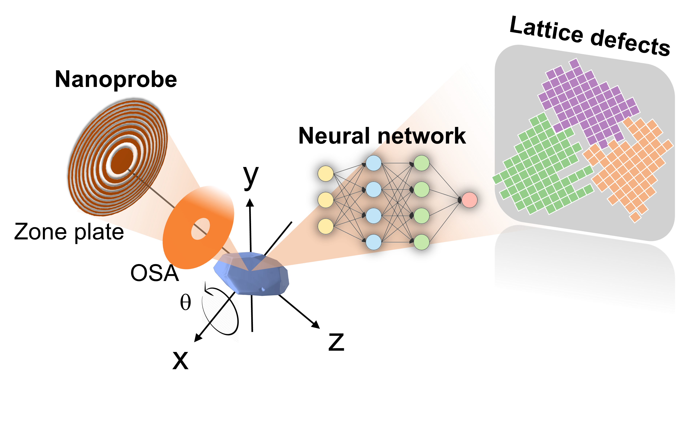
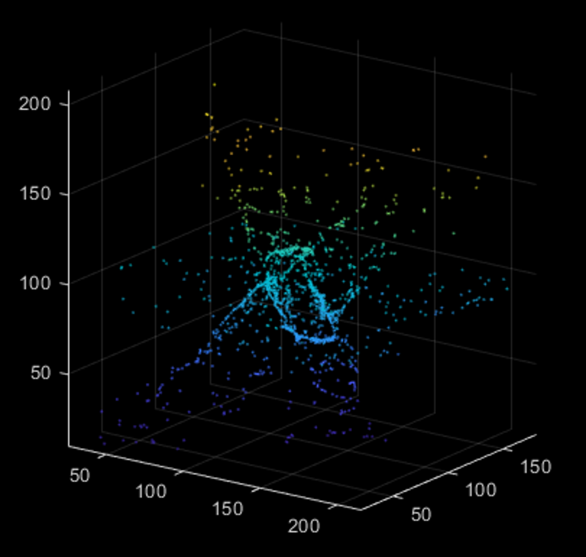
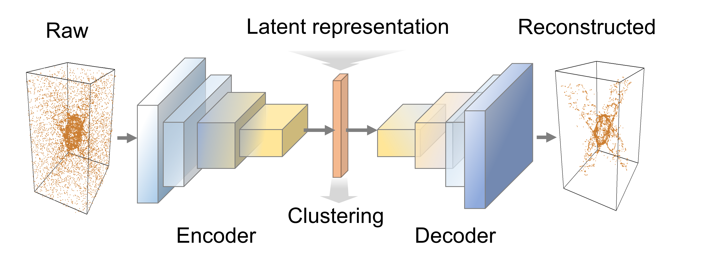

Probing lattice defects in crystalline battery cathode using hard X-ray nanoprobe with data-driven modeling
======


This repository contains the source codes of the following paper:

```
@unpublished{li2021nanodiffraction,
  title={Probing lattice defects in crystalline battery cathode using hard 
X-ray nanoprobe with data-driven modeling},
  author={Li, Jizhou and Hong, Yanshuai and Yan, Hanfei and Chu, Yong S. and Pianetta, Piero and Li, Hong and Ratner, Daniel and Huang, Xiaojing and Yu, Xiqian and Liu, Yijin},
  year={2021},
  note={doi: 10.1016/j.ensm.2021.12.019}
}
```
# Background & Key Contributions
- **Lattice defects**, e.g., dislocations and grain boundaries, critically impact the properties of crystalline battery cathode materials.
- A long-standing challenge is to probe the meso-scale heterogeneity and evolution of lattice defects with sensitivity to atomic-scale details. 
- We tackle this issue with a unique combination of ___X-ray nanoprobe diffractive imaging___ and ___advanced machine learning techniques___.
- These results pave a direct way to the understanding of crystalline battery materials’ response under external stimuli with high fidelity, which provides valuable empirical guidance to defect-engineering strategies for improving the cathode materials against aggressive battery operation.

# Imaging technique

The hard X-ray nanoprobe beamline [3-ID](https://www.bnl.gov/nsls2/beamlines/beamline.php?r=3-ID) of [National Synchrotron Light Source II](https://www.bnl.gov) is used to perform the scanning X-ray microscopy measurements. The experiment was performed with a 30x30 nm<sup>2</sup> X-ray beam. The scanning step size was 100 nm, thus the pixel size of the obtained images is 100x100 nm<sup>2</sup>.

The sample was rotated over a 180<sup>o</sup> range with an XRD detector recording the diffraction pattern at each rotation angle in order to locate the target Bragg peak. A pixel array detector was then oriented to measure the strongest (101) peak. The crystal was rocked over a 2<sup>o</sup> angular range in the vicinity of the (101) Bragg peak, and a two-dimensional raster scan was conducted at each rocking angle. The local Bragg diffraction measurements were performed in sync with the raster scan, and the raster scans were repeated for a series of rocking angles with diffraction signals above the noise level. 

<p align = "center">
</p><p align = "center">
Fig.1. Example diffraction patterns from the hard X-ray nanoprobe.
</p>


# Imaging Data Analysis

- The raw diffraction pattern in our experiments at each pixel is a movie of about 0.5million pixels.
- The dimension for meaningful analysis is too high for conventional approaches. 
- We thus have the following analysis pipeline:
   - Conversion to point clouds
   - Denoising 
   - Feature extraction
<p align = "center">
</p><p align = "center">
Fig.2. Example of the converted point cloud of the nanodiffraction pattern.
</p>

## **Denoising**
We use the [LPA-ICI algorithm](https://ieeexplore.ieee.org/document/8933110) to remove the noise and strengthen the shape of point cloud data. 

```
[pcd_de] = PCD_Filtering_LPAICI_mex(ptCloudB.Location,5，2);
```


## **Feature Extraction**
The implementation is based on the [FoldingNet](https://arxiv.org/abs/1712.07262) approach. The autoencoder is trained by minimizing a Chamfer distance function between the original point-cloud data and reconstructed data. The encoder uses a graph-based architecture, and the decoder is based on the folding architecture, which essentially forms a universal 2D-to-3D mapping. 

<p align = "center">
</p><p align = "center">
Fig.3. Illustration of the network architecture.
</p>

```
python main.py --exp_name diffractiontest --dataset_root /data --encoder foldnet --k 32 --dropout 0.5 --shape plane --dataset diffraction  --workers 50 
```

An example of applying the [trained model](/models/Reconstruct_diffractiontest_20210509_foldnet) to interprete the nanodiffraction data can be found [here](demo_inspection.ipynb). 
